# interrobang ‽

[](https://github.com/Quesadius/interrobang/actions/workflows/ci.yml)


**Build beautiful terminal user interfaces in Python.**

<p align="center">
  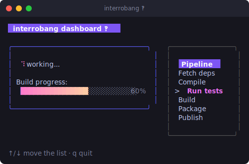
</p>

interrobang is a pure-Python toolkit for crafting TUIs, built around two ideas:

- a tiny **runtime** built on **The Elm Architecture** — your app is a *model*,
  an *update* function, and a *view* function, and that's it; and
- a fluent **styling engine** for color, layout, padding, and borders that looks
  great everywhere and degrades gracefully on lesser terminals.

It has **zero dependencies** (just the standard library), runs on Python 3.10+,
and is built to be **thoroughly tested** — your application logic is pure, so you
can verify it without ever opening a terminal.

```python
import interrobang as irb
from interrobang import KeyMsg, quit
from interrobang.style import Style, Color, ROUNDED


class Hello:
    def init(self):
        return None

    def update(self, msg):
        if isinstance(msg, KeyMsg) and msg.key in ("q", "ctrl+c", "esc"):
            return self, quit
        return self, None

    def view(self):
        box = (
            Style()
            .bold()
            .foreground(Color("#FAFAFA"))
            .background(Color("#7D56F4"))
            .padding(1, 3)
            .border(ROUNDED)
            .border_foreground(Color("#7D56F4"))
        )
        return box.render("Hello, there!\nPress q to quit.")


if __name__ == "__main__":
    irb.run(Hello(), alt_screen=True)
```

## Install

```bash
pip install interrobang        # from PyPI (once published)
pip install -e .               # from a checkout, for development
```

No build step, no compiled extensions, no transitive dependencies.

## The Elm Architecture in 60 seconds

Every interrobang app is an object with three methods:

| Method | Signature | Job |
| --- | --- | --- |
| `init` | `() -> Command \| None` | Return a command to kick off at startup (or `None`). |
| `update` | `(msg) -> (model, Command \| None)` | Given the current state and a message, compute the next state. **Pure** — no I/O. |
| `view` | `() -> str` | Render the current state to a string. The runtime paints it. |

Messages flow in (key presses, resizes, timers, results of background work), you
fold them into new state, and the runtime repaints. Side effects never happen in
`update`; instead you *return a command* and the runtime runs it for you, feeding
the result back as another message. That separation is what keeps the whole
thing testable.

```python
results = irb.testing.feed(Counter(), [KeyMsg(KeyType.UP), KeyMsg(KeyType.UP)])
assert results[-1].model.count == 2
```

## Styling

`Style` objects are immutable and chainable. Build one once, reuse it forever.

```python
from interrobang.style import Style, Color, AdaptiveColor, ROUNDED, join_horizontal, CENTER

title = Style().bold().foreground(Color("#FAFAFA")).background(Color("#FF5F87")).padding(0, 2)

card = (
    Style()
    .border(ROUNDED)
    .border_foreground(Color("63"))
    .padding(1, 2)
    .width(30)
    .foreground(AdaptiveColor(light="#1A1A1A", dark="#DDDDDD"))
)

print(join_horizontal(CENTER, card.render("Left"), card.render("Right")))
```

Colors automatically degrade from 24-bit truecolor → 256-color → 16-color → no
color depending on what the terminal supports, so the same code looks right on a
modern terminal and over an ancient SSH session alike. `AdaptiveColor` even picks
different colors for light and dark backgrounds.

## Batteries-included components

interrobang ships a broad set of ready-made widgets. Each is a small model with
its own `update`/`view` that you embed in your app:

| Component | What it is |
| --- | --- |
| `Spinner` | Animated activity indicator (12 presets) |
| `TextInput` | Single-line editable field with cursor & password mode |
| `Progress` | Horizontal progress bar, solid or gradient |
| `Viewport` | Scrollable text window |
| `List` | Selectable, filterable list |
| `Table` | Scrollable grid with row selection |
| `Paginator` | Pagination math + a page indicator |
| `KeyBinding` / `Help` | Declarative keys and an auto-generated help view |
| `FilePicker` | Filesystem browser |

```python
from interrobang.components import Spinner, DOTS

class Model:
    def __init__(self):
        self.spinner = Spinner(DOTS)
    def init(self):
        return self.spinner.tick
    def update(self, msg):
        self.spinner, cmd = self.spinner.update(msg)
        return self, cmd
    def view(self):
        return f"{self.spinner.view()} Loading..."
```

## Gallery

A few components, rendered from their real output (the spinner and progress bar
animate when viewed in a browser):

| | |
| --- | --- |
|  |  |
| 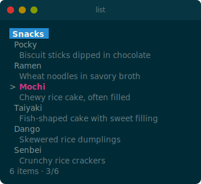 | 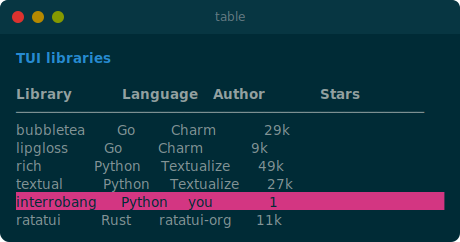 |
| 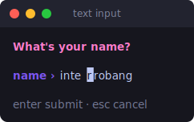 | 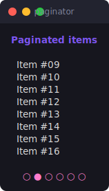 |
| 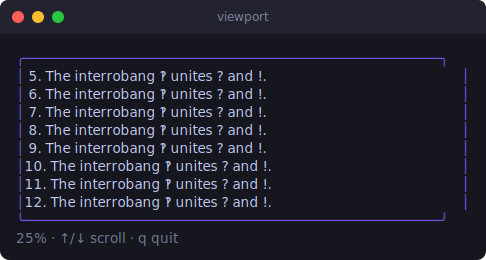 | 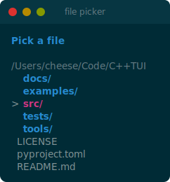 |

See the [styling gallery](docs/images/styling.svg) and [layout demo](docs/images/layout.svg) too.

## Theming

Components read their colors from the **active theme**. interrobang ships three
— `SOLARIZED_DARK` (the default), `SOLARIZED_LIGHT`, and `NEON` — or define your
own `Theme`:

| Solarized Dark | Solarized Light | Neon |
| --- | --- | --- |
| 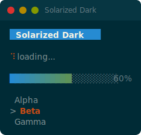 | 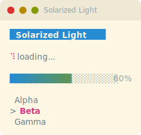 | 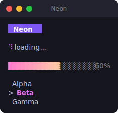 |

```python
import interrobang as irb

irb.set_theme(irb.SOLARIZED_LIGHT)   # re-styles components already on screen, too
```

`set_theme` updates live components, so a "toggle light/dark" key is trivial. See
the [styling guide](docs/styling.md#theming) for custom themes and
`examples/themes.py` for a side-by-side.

## Examples

The [`examples/`](examples/) directory has runnable programs for every feature —
run any of them with `python examples/<name>.py`:

- `counter.py` — the smallest complete app
- `styles.py` — a gallery of the styling engine
- `layout.py` — joining and placing blocks
- `spinner.py`, `textinput.py`, `progress.py`, `viewport.py`, `list.py`,
  `table.py`, `paginator.py`, `help.py`, `filepicker.py` — one per component
- `mouse.py` — mouse reporting
- `timer.py` — timers with `tick`
- `dashboard.py` — a larger app composing several components
- `themes.py` — the built-in themes side by side

Pass `--theme solarized-light` (or `solarized-dark` / `neon`) to any interactive
example, e.g. `python examples/dashboard.py --theme solarized-light`.

## Documentation

Full guides live in [`docs/`](docs/):

- [Tutorial](docs/tutorial.md) — build your first app step by step
- [The Elm Architecture](docs/architecture.md) — models, messages, commands
- [Styling guide](docs/styling.md) — colors, borders, layout
- [Components reference](docs/components.md) — every widget in detail
- [Testing guide](docs/testing.md) — verifying your app

## Testing your own apps

Because `update` is pure, you test it like any function:

```python
from interrobang.testing import feed, run_command, drive

# Drive update/view directly — fully deterministic, no terminal:
steps = feed(MyApp(), [KeyMsg(KeyType.RUNES, "a")])
assert "a" in steps[-1].view

# Assert what command a step requested:
msgs = run_command(steps[-1].command)

# Or run the real event loop headlessly:
output, final = drive(MyApp(), [KeyMsg(KeyType.ENTER)])
```

## Development

```bash
python -m venv .venv && source .venv/bin/activate
pip install -e ".[dev]"
pytest                      # run the test suite
pytest --cov=interrobang    # with coverage
```

## License

MIT. See [LICENSE](LICENSE).
