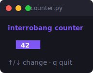

# Tutorial: your first interrobang app

This tutorial builds a small but complete app — a to-do list — from nothing. By
the end you'll understand the three methods every app implements, how to react
to keyboard input, how to manage state, and how to drop in a ready-made
component.

Here's the kind of thing you'll be making (the `counter` example):



## 1. Install

```bash
pip install interrobang        # or: pip install -e . from a checkout
```

interrobang has no dependencies, so this is instant.

## 2. The three methods

Every interrobang app is an object with three methods:

```python
class App:
    def init(self):
        ...   # return a startup command, or None

    def update(self, msg):
        ...   # given a message, return (new_state, command)

    def view(self):
        ...   # render the current state to a string
```

That's the whole contract. The runtime calls `init` once, then calls `update`
every time something happens (a key press, a resize, a timer), and `view`
whenever it needs to repaint.

## 3. Hello, world

Let's start with the smallest thing that runs:

```python
import interrobang as irb
from interrobang import KeyMsg, quit

class App:
    def init(self):
        return None

    def update(self, msg):
        if isinstance(msg, KeyMsg) and msg.key in ("q", "ctrl+c"):
            return self, quit
        return self, None

    def view(self):
        return "Hello, there! Press q to quit."

if __name__ == "__main__":
    irb.run(App())
```

Run it with `python app.py`. You'll see the text; press `q` and it exits
cleanly. A few things to notice:

- `update` returns a **tuple**: the next model and a command. Returning
  `self, None` means "no state change, nothing to do."
- `quit` is a **command** — `update` doesn't quit the program directly, it
  *asks* the runtime to by returning `quit`. (More on commands in the
  [architecture guide](architecture.md).)
- `msg.key` gives you a friendly name like `"q"`, `"ctrl+c"`, `"enter"`, or
  `"up"`. That's almost always what you want to match on.

## 4. Adding state

Let's hold a list of to-do items and a cursor. State just lives on the object:

```python
import interrobang as irb
from interrobang import KeyMsg, quit

class Todo:
    def __init__(self):
        self.items = ["Learn interrobang", "Build a TUI", "Profit"]
        self.done = set()
        self.cursor = 0

    def init(self):
        return None

    def update(self, msg):
        if isinstance(msg, KeyMsg):
            if msg.key in ("q", "ctrl+c"):
                return self, quit
            if msg.key in ("up", "k"):
                self.cursor = max(0, self.cursor - 1)
            elif msg.key in ("down", "j"):
                self.cursor = min(len(self.items) - 1, self.cursor + 1)
            elif msg.key in ("enter", " ", "space"):
                self.done ^= {self.cursor}  # toggle
        return self, None

    def view(self):
        lines = ["To-do:", ""]
        for i, item in enumerate(self.items):
            check = "[x]" if i in self.done else "[ ]"
            pointer = ">" if i == self.cursor else " "
            lines.append(f"{pointer} {check} {item}")
        lines += ["", "↑/↓ move · enter toggle · q quit"]
        return "\n".join(lines)

if __name__ == "__main__":
    irb.run(Todo(), alt_screen=True)
```

Notice `alt_screen=True`: that switches to the terminal's alternate screen
(like `vim` or `less`), so your app gets the whole screen and leaves the
scrollback untouched when it exits. Use it for full-screen apps; leave it off
for small inline widgets.

> **Mutate or replace?** This example mutates `self` and returns it. That's
> perfectly fine. If you prefer immutable state, build and return a new object
> instead — the runtime only cares about the model you hand back.

## 5. Make it pretty

Right now it's plain text. Let's bring in the styling engine. Styles are
chainable and immutable, so define them once and reuse them:

```python
from interrobang.style import Style, Color

TITLE = Style().bold().foreground(Color("#7D56F4"))
CURSOR = Style().foreground(Color("#FF7CCB")).bold()
DONE = Style().faint().strikethrough()
HINT = Style().faint()

class Todo:
    # ... __init__, init, update as before ...

    def view(self):
        lines = [TITLE.render("To-do"), ""]
        for i, item in enumerate(self.items):
            check = "[x]" if i in self.done else "[ ]"
            text = DONE.render(item) if i in self.done else item
            if i == self.cursor:
                lines.append(CURSOR.render(f"> {check} ") + text)
            else:
                lines.append(f"  {check} {text}")
        lines += ["", HINT.render("↑/↓ move · enter toggle · q quit")]
        return "\n".join(lines)
```

Colors degrade automatically: that `#7D56F4` purple becomes the nearest
256-color on a smaller terminal, the nearest of 16 over an old SSH session, and
simply no color on a monochrome one — you don't write any of that logic. See the
[styling guide](styling.md) for the full toolbox.

## 6. Use a component

You don't have to build everything by hand. interrobang ships widgets you embed.
Let's add a text input so the user can add new items. A component is itself a
little model: you forward messages to it and render its `view()`.

```python
from interrobang.components import TextInput

class Todo:
    def __init__(self):
        self.items = ["Learn interrobang"]
        self.done = set()
        self.cursor = 0
        self.input = TextInput()
        self.input.placeholder = "new item..."
        self.adding = False

    def init(self):
        return None

    def update(self, msg):
        if self.adding:
            return self._update_adding(msg)
        if isinstance(msg, KeyMsg):
            if msg.key in ("q", "ctrl+c"):
                return self, quit
            if msg.key == "a":
                self.adding = True
                self.input.reset()
            elif msg.key in ("up", "k"):
                self.cursor = max(0, self.cursor - 1)
            elif msg.key in ("down", "j"):
                self.cursor = min(len(self.items) - 1, self.cursor + 1)
            elif msg.key in ("enter", "space"):
                self.done ^= {self.cursor}
        return self, None

    def _update_adding(self, msg):
        if isinstance(msg, KeyMsg):
            if msg.key == "enter":
                if self.input.value:
                    self.items.append(self.input.value)
                self.adding = False
                return self, None
            if msg.key == "esc":
                self.adding = False
                return self, None
        self.input, cmd = self.input.update(msg)  # forward to the component
        return self, cmd

    def view(self):
        # ... render items as before ...
        if self.adding:
            return "Add item:\n\n" + self.input.view() + "\n\n(enter to add, esc to cancel)"
        return self._render_list()
```

The key pattern, which you'll use for *every* component, is:

```python
self.component, cmd = self.component.update(msg)
return self, cmd
```

You hand the component each message, it returns its updated self plus any
command it wants run, and you pass that command up to the runtime.

## 7. Test it

Because `update` is pure, you can test your logic with no terminal at all:

```python
from interrobang.testing import feed
from interrobang import KeyMsg, KeyType

def test_toggle():
    results = feed(Todo(), [KeyMsg(KeyType.RUNES, " ")])  # press space
    assert 0 in results[-1].model.done
```

See the [testing guide](testing.md) for the full story.

## Where to go next

- The [architecture guide](architecture.md) explains commands in depth — timers,
  background work, batching, and the terminal-control commands.
- The [styling guide](styling.md) is your reference for colors and layout.
- The [components reference](components.md) documents every widget.
- The [`examples/`](../examples) directory has a runnable program for each one.
